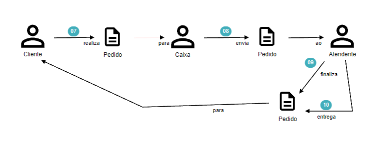
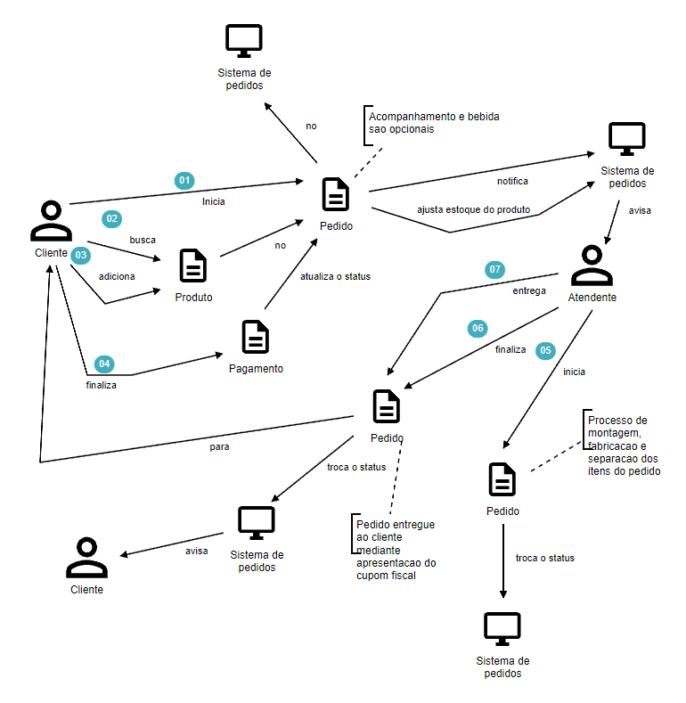

# DDD
Controle de gerenciamento de pedidos

## Sudbominio Principal
- Montagem do pedido pelo app.
- Gerenciamento dos produtos
- Busca de produtos
- Listagem de produtos
- Checkout para pagamento
- Gerenciamento do estoque.
- Identificacao por CPF do cliente

## Subdominio Generico
- Aviso de alteracao de status do pedido e monitoramento em tela.
- Exibicao do tempo de espera.

## Subdominio Suporte
- Gerenciamento de Clientes
- Gerenciamento de Categorias
- Busca de categorias

## Domain Storytelling
### Dominio Puro


### Dominio Digitalizado


## Linguaguem Ubiqua
### Dicionario
-rout **Cliente**: Toda pessoa que inicia o processo de abertura de um pedido no sistema.
- **Atendente**: Todo pessoa que trabalha na empresa, seja no caixa, cozinha ou atendimento ao cliente.
- **Administrador**: Todo pessoa que trabalha na empresa, e que tenha permissao para gerenciar os produtos, categorias e pedidos na area administrativa do sistema.
- **Produto**: Todo o item comercializado pela empresa
- **Categoria**: Sao categorias que podem ser vinculadas aos produtos.
- **Pedido**: Seria o agrupamento de produtos selecionados pelos clientes, com quantidade, totais e forma de pagamento.
- **Pagamento**: Processo de pagamento de um pedido pelo cliente.

  
## Modelagem do Dominio

## Event Storming
- Acesse https://miro.com/app/board/uXjVM4hKAVc=/?share_link_id=546864818586

# API
## Rotas
> Documentacao das rotas disponiveis, elas podem ser acessadas tambem nessa collection (https://documenter.getpostman.com/view/483864/2s93zFWK1f)
### Cliente
- Path `/cliente`
    - **POST**: Cria um novo cliente
      - **HTTP Code**:
        - 200 - cadastrado corretamente
        - 403 - payload com dados invalidos
  - **Payload**
```json
{
"cpf": "80845052209",
"nome": "Lukete",
"email": "email@example.com",
"telefone": "+553199345783"
}
```
- **Resposta**
```json
{
"id": "5a68ef06-1b8c-11ee-8fe5-023afac12b88",
"cpf": "80845052209",
"nome": "Lukete",
"email": "email@example.com",
"telefone": "+553199345783"
}
```

 Path  `/cliente/{cpf}`
  - **GET**: Busca cliente pelo cpf
  - **HTTP Code**:
    - 200 - encontrou cliente
    - 404 - cliente nao existe
  - **Resposta**
```json
{

"id": "5a68ef06-1b8c-11ee-8fe5-023afac12b88",
"cpf": "80845052209",
"nome": "Lukete",
"email": "email@example.com",
"telefone": "+553199345783"
}
```

### Produto
- Path `/produto`
  - **POST**: Cria um novo produto
  - **HTTP Code**:
    - 200 - cadastrado corretamente
    - 403 - payload com dados invalidos
  - **Payload**
```json
{
"nome": "Produto x",
"descricao": "Descricao y",
"id_categoria": "5a68ef06-1b8c-11ee-8fe5-023afac12b88",
"preco": 99.89,
"imagens": "https://random.imagecdn.app/500/500, https://random.imagecdn.app/500/500, https://random.imagecdn.app/500/500, https://random.imagecdn.app/500/500"
}
```
- **Resposta**
```json
{
"id": "5a68ef06-1b8c-11ee-8fe5-023afac12b88",
"nome": "Produto x",
"descricao": "Descricao y",
"id_categoria": "5a68ef06-1b8c-11ee-8fe5-023afac12b88",
"preco": 99.89,
"imagens": "https://random.imagecdn.app/500/500, https://random.imagecdn.app/500/500, https://random.imagecdn.app/500/500, https://random.imagecdn.app/500/500"
}
```

 Path  `/produto/categoria/{id_categoria}`
  - **GET**: Busca produto pela categoria
  - **HTTP Code**:
    - 200 - encontrou produto
    - 404 - produto nao existe
  - **Resposta**
```json
[{
"id": "5a68ef06-1b8c-11ee-8fe5-023afac12b88",
"nome": "Produto x",
"descricao": "Descricao y",
"id_categoria": "5a68ef06-1b8c-11ee-8fe5-023afac12b88",
"preco": 399.34,
"imagens": "https://random.imagecdn.app/500/500, https://random.imagecdn.app/500/500"
}]
```

 Path  `/produto/{id}`
  - **PATH**: Edita um produto
  - **HTTP Code**:
    - 200 - encontrou produto
    - 404 - produto nao existe
  - **Resposta**
```json
{
"nome": "Produto x editado",
"descricao": "Descricao y editada",
"id_categoria": "5a68ef06-1b8c-11ee-8fe5-023afac12b88",
"preco": 399.34,
"imagens": "https://random.imagecdn.app/500/500, https://random.imagecdn.app/500/500"
}
``` 

 Path  `/produto/{id}`
  - **DELETE**: Deleta um produto
  - **HTTP Code**:
    - 200 - deletou o produto com sucesso
    - 404 - produto nao existe
  - **Resposta**
```json
{
 "success": true
}
```

### Pedido
- Path `/pedido`
  - **POST**: Cria um novo pedido
  - **HTTP Code**:
    - 200 - cadastrado corretamente
    - 403 - payload com dados invalidos
  - Possiveis status:
    - C = criado
    - F = finalizado
    - P = preparado
    - E = entregue
    - N = cancelado
  - **Payload**
```json
{
  "status": "C",
  "id_cliente": "5a68ef06-1b8c-11ee-8fe5-023afac12b88",
  "pedido_items": [
    {
      "quantidade": 1,
      "id_produto": "5a68ef06-1b8c-11ee-8fe5-023afac12b88"
    },
    {
      "quantidade": 4,
      "id_produto": "5a68ef06-1b8c-11ee-8fe5-023afac12b88"
    }
  ]
}
```
- **Resposta**
```json
{
  "id": 1,
  "data_criacao": "2023-31-03 14:22:10",
  "id_cliente": "5a68ef06-1b8c-11ee-8fe5-023afac12b88",
  "status": "C"
}
```

 Path  `/pedido`
  - **GET**: Busca todos os pedidos
  - **HTTP Code**:
    - 200 - sucesso
  - **Resposta**
```json
[
  {
  "id": 1,
  "data_criacao": "2023-31-03 14:22:10",
  "clientes": {
    "id": "5a68ef06-1b8c-11ee-8fe5-023afac12b88",
    "cpf": "80845052209",
    "nome": "Lukete",
    "email": "email@example.com",
    "telefone": "+553199345783"
  },
  "status": "C",
  "pedido_items": [
    {
      "id": "5a68ef06-1b8c-11ee-8fe5-023afac12b88",
      "quantidade": 1,
      "produto": {
        "id": "5a68ef06-1b8c-11ee-8fe5-023afac12b88",
        "nome": "Produto x",
        "descricao": "Descricao y",
        "id_categoria": "5a68ef06-1b8c-11ee-8fe5-023afac12b88",
        "preco": 399.34,
        "imagens": "https://random.imagecdn.app/500/500, https://random.imagecdn.app/500/500"
      }
    }
   ]
  },
  {
  "id": 2,
  "data_criacao": "2023-31-03 15:44:30",
  "status": "P",
  "clientes": {
    "id": "5a68ef06-1b8c-11ee-8fe5-023afac12b88",
    "cpf": "80845052209",
    "nome": "Lukete",
    "email": "email@example.com",
    "telefone": "+553199345783"
  },
   "pedido_items": [
    {
      "id": "5a68ef06-1b8c-11ee-8fe5-023afac12b88",
      "quantidade": 4,
      "produto": {
        "id": "5a68ef06-1b8c-11ee-8fe5-023afac12b88",
        "nome": "Produto x",
        "descricao": "Descricao y",
        "id_categoria": "5a68ef06-1b8c-11ee-8fe5-023afac12b88",
        "preco": 399.34,
        "imagens": "https://random.imagecdn.app/500/500, https://random.imagecdn.app/500/500"
      }
    }
   ]
  },
]
```

### Categoria


 Path  `/categoria`
  - **GET**: Lista todas as categorias
  - **HTTP Code**:
    - 200 - sucesso 
  - **Resposta**
```json
[
  {
    "id": "5a68ef06-1b8c-11ee-8fe5-023afac12b88",
    "nome": "Categoria 1"
  },
  {
    "id": "5a68ef06-1b8c-12ee-8fe5-023afac12b88",
    "nome": "Categoria 2"
  } 
]
```

# Comandos
## Desenvolvimento
- Local **com** docker `docker compose up`
- Local **sem** docker `npm run dev`

### Producao
> Sistema utiliza container docker pronto com o build realizado.

### K8S
- Para subir no **kubernetes** basta rodar o comando `npm run deploy && npm run k8s`